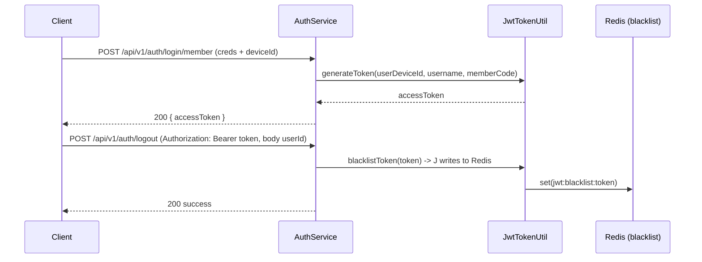
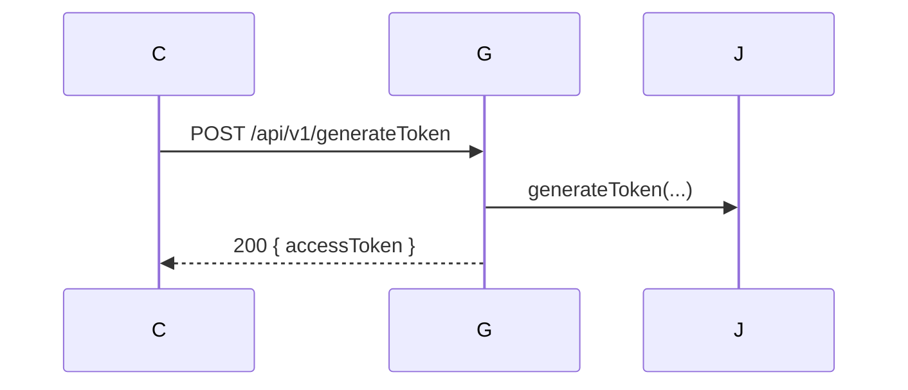
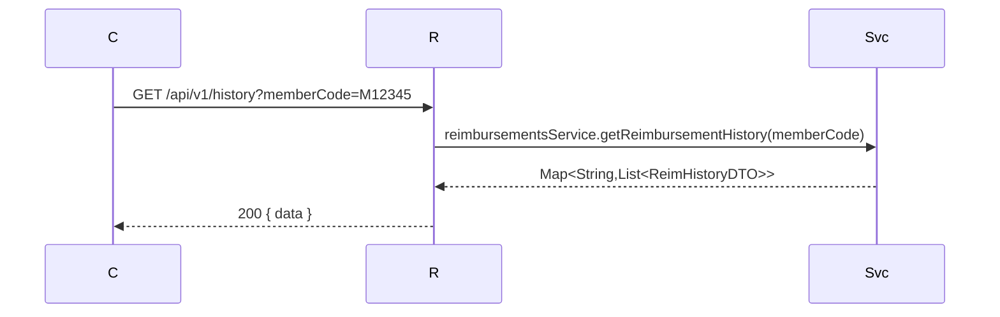
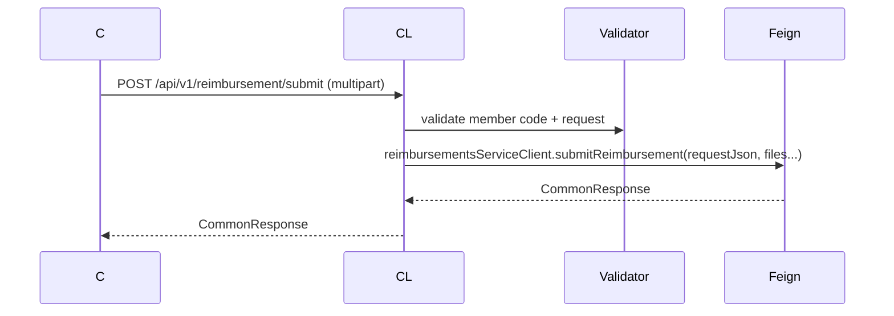
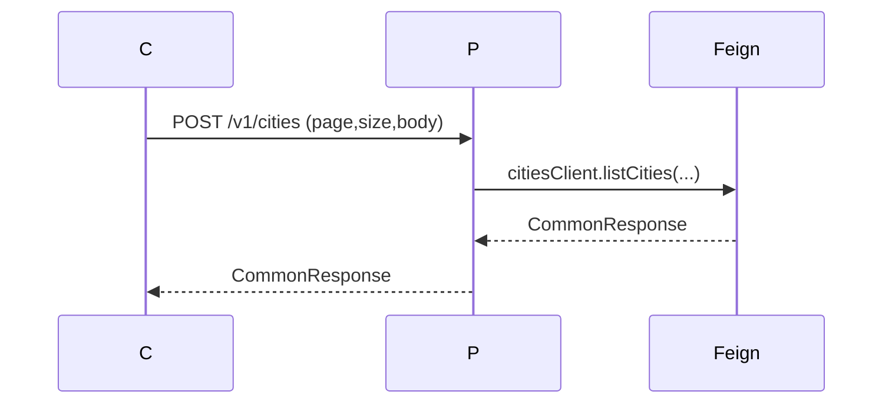
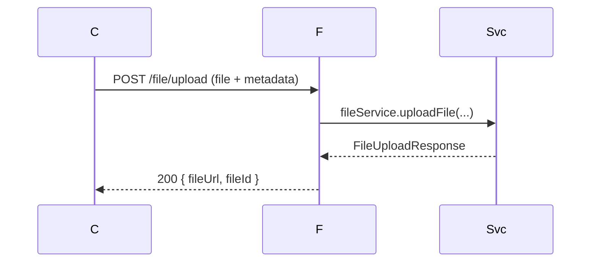
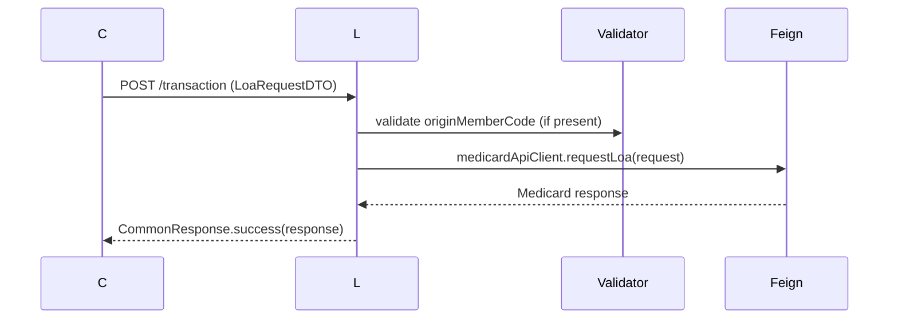
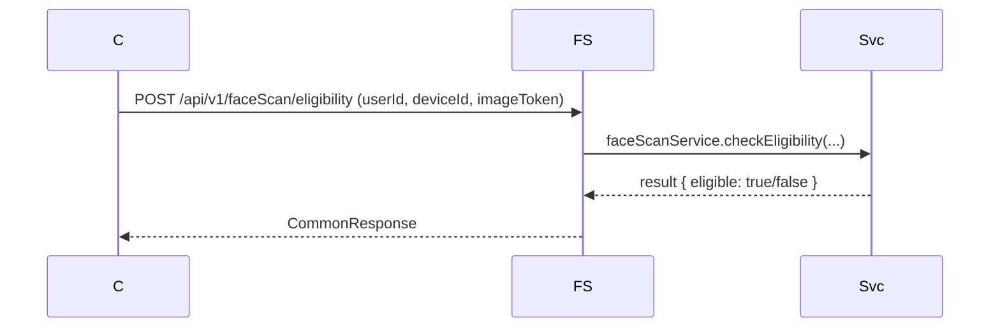
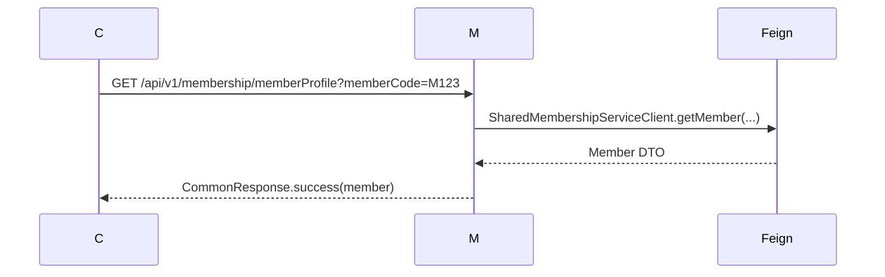

# Non-shared Services API Catalog (excluding `notification-service`)

This document lists public controller endpoints belonging to non-shared services in this repository (services/** except `shared-*` and excluding `services/notification-service`). For each API: purpose, request/response examples, and a simple flow diagram (Mermaid). Use this as a developer reference — see each service's own docs for deeper details.

Note: some controllers act as proxies to shared services (they forward requests via Feign). Where relevant I indicate the proxied call.

---

## Contents
- Auth Service (auth-service)
- Generate Token (auth-service)
- Reimbursement Service (reimbursement-service)
- Claims Service (claims-service) — Reimbursement proxy
- Provider Service (provider-service)
- File Management Service (filemanagement-service)
- LOA Service (loa-service)
- FaceScan Service (facescan-service)
- Membership Service (membership-service)

---

## Auth Service (/api/v1/auth)
Controller: `AuthController`

Main endpoints:
- POST /api/v1/auth/login/member
- POST /api/v1/auth/login/nonmember
- POST /api/v1/auth/verifyOtp
- POST /api/v1/auth/resendOtp
- POST /api/v1/auth/logout
- POST /api/v1/auth/userDetails
- POST /api/v1/auth/registerbio
- POST /api/v1/auth/biometric (and /biometric/login, /biometric/challenge, /biometric/storePasskeyHash)
- POST /api/v1/auth/consent/list and /consent/store

Purpose:
- Authentication (OTP, password, biometric), registration flows, user details, logout. Logout invalidates the token (Redis blacklist).

Request (login/member) example:
```json
{
  "email": "user@example.com",
  "password": "s3cret",
  "deviceId": "device-abc-123"
}
```

Response (success token example):
```json
{
  "statusCode": "200",
  "response": "SUCCESS",
  "data": {
    "accessToken": "<jwt-token>",
    "expiresIn": 3600
  },
  "traceId": "..."
}
```

Logout request:
- POST /api/v1/auth/logout
- Body: { "userId": "user@example.com" } (the username/email/mobile that appears in the token `username` claim)
- Header: Authorization: Bearer <token>, userId header (deviceId) required by filter

Logout response:
```json
{ "statusCode": "200", "response": "SUCCESS", "data": { "message": "User logged out successfully" } }
```

Flow (login -> logout):



Notes:
- JWT validation occurs in `JwtRequestFilter` which now rejects blacklisted tokens via Redis check.
- Many endpoints use `@DecryptBody`/`@EncryptResponse` annotations — requests/responses are encrypted between client and service in production flows.

---

## Generate Token Controller (auth-service)
Controller: `GenerateTokenController`

Endpoints:
- POST /api/v1/generateToken

Purpose:
- Utility endpoint used to generate tokens (internal/testing usage). Returns JWT for provided credentials/device.

Request/response: similar to login; returns access token in response header or body.

Flow:


---

## Reimbursement Service (/api/v1) — reimbursement-service
Controller: `ReimbursementController`

Endpoints:
- GET /api/v1/history?memberCode={memberCode}

Purpose:
- Returns reimbursement history for a member code. Calls local `ReimbursementsService`.

Request example:
- GET /api/v1/history?memberCode=M12345

Response example:
```json
{
  "statusCode": "200",
  "response": "SUCCESS",
  "data": {
    "closed": [{ "controlCode":"C1", "amount": 123.45 }],
    "open": []
  }
}
```

Flow:


---

## Claims Service — Reimbursement Proxy (/api/v1/reimbursement)
Controller: `ReimbursementProxyController`

Endpoints:
- GET /api/v1/reimbursement/history?memberCode={memberCode}
- POST /api/v1/reimbursement/claimNature
- POST /api/v1/reimbursement/bankMaster
- POST /api/v1/reimbursement/viewAmountBreakDown (JSON body)
- POST /api/v1/reimbursement/submit (multipart/form-data: request JSON + files)
- POST /api/v1/reimbursement/resubmit (multipart/form-data)

Purpose:
- Proxy and validation layer for reimbursements. Validates member code, prepares Feign requests to `reimbursements-service`.

Submit request (multipart) example (pseudo):
```
POST /api/v1/reimbursement/submit
Content-Type: multipart/form-data
Parts:
 - request: {"memberCode":"M123","serviceType":"OPD", ...}
 - serviceInvoice: file(s)
 - medcert: file(s)
```

Response example:
```json
{ "statusCode":"200", "response":"SUCCESS", "data": { "controlCode":"C12345", "status":"SUBMITTED" } }
```

Flow (submit):


---

## Provider Service
Controllers:
- `CitiesProxyController` (POST /v1/cities)
- `ProviderProxyController` (POST /api/v1/provider/doctor, POST /api/v1/provider/hospital)

Purpose:
- Proxy to shared-provider-service; paginated lists of doctors/hospitals/cities.

Request example (cities):
```json
{
  "state": "XY",
  "otherFilters": {}
}
```
Query params: page, size, optional search.

Response example:
```json
{ "statusCode":"200", "response":"SUCCESS", "data": [ { "cityId":"C1","name":"City A" } ] }
```

Flow:


---

## File Management Service (/file)
Controller: `FileController`

Endpoints:
- GET /file/findLinksByTags?tag1=...&tag2=...
- POST /file/upload (multipart/form-data: file + controlCode + documentType + folderName)

Purpose:
- Upload files, get links by tags.

Upload request (multipart):
- file: binary
- controlCode: string
- documentType: string
- folderName: string

Upload response:
```json
{ "fileUrl":"https://.../file.jpg", "fileId":"F123" }
```

Flow:


---

## LOA Service
Controller: `LoaController`

Endpoints:
- POST /transaction
- GET /transaction/history?page=&size=&originMemberCode=&hospitalCode=
- GET /transaction/historyDetails/{id}?systemOrigin=&originMemberCode=
- GET /download/loa?systemOrigin=&requestId=&originMemberCode=

Purpose:
- Request LOA (Letter of Authorization) from external Medicard APIs, list and download LOA records.

Request example (request LOA):
```json
{
  "originMemberCode":"M123",
  "hospitalCode":"H123",
  "patient": { "name":"John Doe", "dob":"1980-01-01" },
  "serviceType":"INPATIENT"
}
```

Response: `CommonResponse` with proxied Medicard API response (object shape depends on Medicard).

Flow (request LOA):


---

## FaceScan Service (api path: /api/v1/faceScan)
Controller: `FaceScanController`

Endpoints:
- POST /api/v1/faceScan/eligibility
- POST /api/v1/faceScan/acceptTnc
- POST /api/v1/faceScan/storeResult
- POST /api/v1/faceScan/history
- POST /api/v1/faceScan/fetchResult
- POST /api/v1/faceScan/masterData

Purpose:
- Face-scan related flows: eligibility check, store results, history, fetch.

Typical request/response: JSON payloads (face image tokens, deviceId, userId). Responses are `CommonResponse` wrappers.

Flow (eligibility -> storeResult):


---

## Membership Service (membership-service)
Controllers:
- `MembershipProxyController` (`/api/v1/membership`) — GET /memberProfile, /dependent, /maternity
- `VirtualIdFeignProxyController` — GET /api/v1/virtual-id
- `UtilizationProxyController` — POST /api/v1/utilization/optimizedspcall, POST /api/v1/utilization/utilizationpdf
- `FileManagmentProxyController` — (proxy endpoints for file management)

Purpose:
- Member/profile retrieval, utilization reports, and proxy endpoints to other services.

Example memberProfile request:
- GET /api/v1/membership/memberProfile?memberCode=M123

Response:
```json
{ "statusCode":"200", "response":"SUCCESS", "data": { "memberCode":"M123","name":"Jane Doe", ... } }
```

Flow (memberProfile):


---

## Notes, Caveats and Next Steps
- This document is an automated repository-level summary focused on controller endpoints. For exact request/response DTO fields inspect the `domain.dto`, `domain.request`, and `domain.response` classes in each service's `src/main/java` folder.
- Many endpoints use `@DecryptBody` and `@EncryptResponse` — production requests/responses are encrypted; tools like Postman must be configured to send plaintext only when testing with Postman-Token or test mode.
- Logout and JWT invalidation use Redis blacklist (key pattern `jwt:blacklist:<token>`). Ensure Redis connection is configured in `auth-service` properties in staging/production.
- If you want, I can:
  - Expand each endpoint into full request/response schemas by reading DTO classes and produce fully-detailed JSON schemas.
  - Generate a single consolidated Postman collection for all these endpoints (unencrypted request bodies for testing).
  - Produce a PDF or enhanced docs with per-endpoint sequence diagrams and acceptance tests.

---  
Generated from codebase scan (controllers and mappings) on workspace.

