# Non-shared Services — Detailed API Catalog

This document expands the summary in `NON_SHARED_SERVICES_API_DOC.md` with full request/response JSON schemas (where applicable), multipart examples, and flowchart-style Mermaid diagrams for each endpoint. It covers non-shared services under `services/` (excluding `shared-*` services and `services/notification-service`).

Notes:
- Request/response shapes are inferred from controller/DTO names and common patterns in the codebase. For exact field constraints, consult the DTO classes in each service's `src/main/java`.
- Multipart examples show part names and sample values (per your request).

---

## Auth Service (auth-service)
Base path: `/api/v1/auth`

### POST /api/v1/auth/login/member
Description: Member login — password/OTP flow that issues JWT bound to deviceId and includes username (email/mobile) claim.

Request JSON:
```json
{
  "email": "user@example.com",
  "password": "string",        // optional depending on flow
  "deviceId": "device-abc-123",
  "otp": "123456"              // optional for OTP flows
}
```

Response (success):
```json
{
  "statusCode": "200",
  "response": "SUCCESS",
  "data": {
    "accessToken": "<jwt>",
    "expiresIn": 3600,
    "memberCode": "M12345"
  },
  "traceId": "..."
}
```

Flowchart:

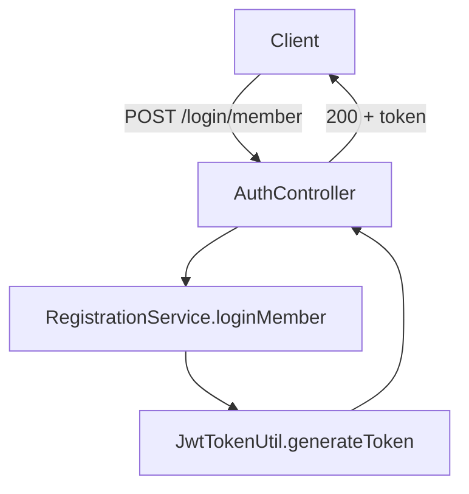

---

### POST /api/v1/auth/logout
Description: Invalidate the presented token. Body `userId` is the username (email/mobile) that appears inside token claim `username`. Header `Authorization: Bearer <token>` required. DeviceId header (userId header) is still required by filter.

Request:
```json
{ "userId": "user@example.com" }
```
Headers:
- Authorization: Bearer \<token\>
- userId: device-abc-123 (device id header required by JWT filter)

Response:
```json
{ "statusCode":"200","response":"SUCCESS","data":{"message":"User logged out successfully"} }
```

Notes:
- Logout writes blacklist entry to Redis keyed by `jwt:blacklist:<token>` with TTL = token expiry.

Flowchart:
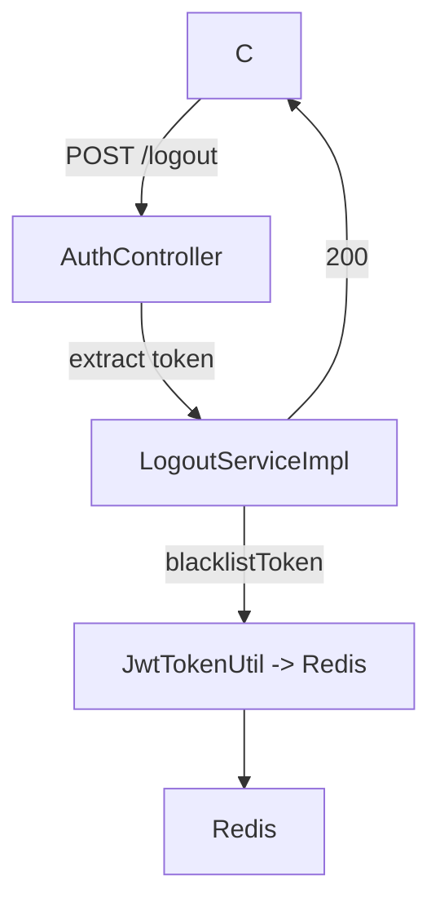

---

### POST /api/v1/auth/verifyOtp, /resendOtp, /userDetails, /registerbio, /biometric/*
Description: OTP verification, resend, user details retrieval, biometric registration/auth flows. All return `CommonResponse` wrappers and may respond with encrypted payloads in production.

General request example (verifyOtp):
```json
{
  "email": "user@example.com",
  "otp": "123456",
  "deviceId": "device-abc-123"
}
```

General response:
```json
{ "statusCode":"200","response":"SUCCESS","data": { /* API-specific */ } }
```

Flowchart (generic):

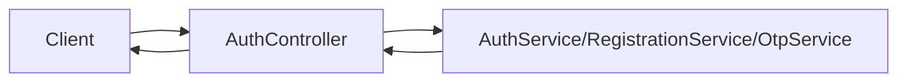

---

## Generate Token Controller (auth-service)
Base: `/api/v1`

### POST /api/v1/generateToken
Purpose: token generation utility (internal/testing).

Request/Response examples follow login patterns.

Flowchart:
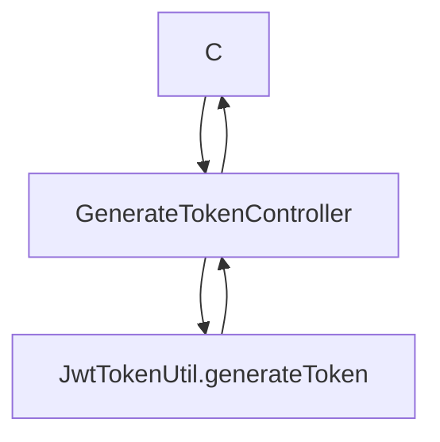

---

## Reimbursement Service (reimbursement-service)
Base: `/api/v1`

### GET /api/v1/history?memberCode={memberCode}
Purpose: fetch reimbursement history for a member.

Response example:
```json
{
  "statusCode":"200",
  "response":"SUCCESS",
  "data": {
    "open": [ { "controlCode":"C1", "amount": 100.0, "date":"2025-12-01" } ],
    "closed": [ { "controlCode":"C2", "amount": 50.0, "date":"2025-10-20" } ]
  }
}
```

Flowchart:
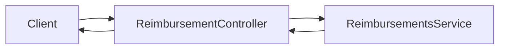

---

## Claims Service — Reimbursement Proxy (claims-service)
Base: `/api/v1/reimbursement`

### GET /history?memberCode={memberCode}
Proxies to reimbursements-service via Feign client.

### POST /claimNature
Returns available claim natures.

### POST /bankMaster
Returns enabled banks master data.

### POST /viewAmountBreakDown
Request JSON (example):
```json
{
  "controlCode": "C123",
  "status": "OPEN",
  "entryCode": "E1"
}
```

### POST /submit (multipart/form-data)
Description: large multipart request — JSON `request` part + multiple optional file parts.

Multipart sample (raw):

- Part `request` (JSON):
```json
{
  "memberCode": "M123",
  "serviceType": "INPATIENT",
  "controlCode": null,
  "totalAmount": 1234.56
}
```
- Part `serviceInvoice`: file (optional)  
- Part `medcert`: file (optional)  
- Part `bankDocuments`: file (optional)  

Response example:
```json
{ "statusCode":"200","response":"SUCCESS","data":{"controlCode":"C12345","status":"SUBMITTED"} }
```

Flowchart (submit):
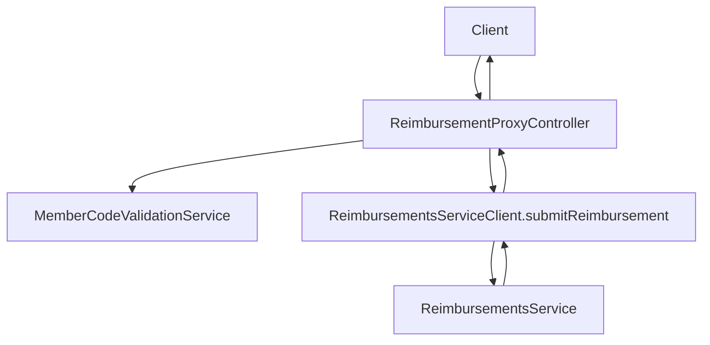

---

## Provider Service (provider-service)
Paths:
- POST /v1/cities
- POST /api/v1/provider/doctor
- POST /api/v1/provider/hospital

Request example (doctor):
```json
{
  "specialty": "cardiology",
  "location": "City A",
  "filters": {}
}
```

Response: `CommonResponse` with paginated list, e.g.:
```json
{ "statusCode":"200","response":"SUCCESS","data": { "items":[{"id":"D1","name":"Dr X"}], "page":0, "size":5, "total":123 } }
```

Flowchart:
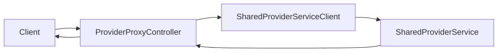

---

## File Management Service (filemanagement-service)
Base: `/file`

### GET /file/findLinksByTags?tag1=...&tag2=...
Returns list of file URLs matching tags.

### POST /file/upload (multipart/form-data)
Multipart sample:
- Part `file`: binary file  
- Query/fields:
  - controlCode: "C123"
  - documentType: "INVOICE"
  - folderName: "reimbursements/2026"

Response:
```json
{ "fileUrl":"https://cdn/.../file.jpg", "fileId":"F123" }
```

Flowchart:
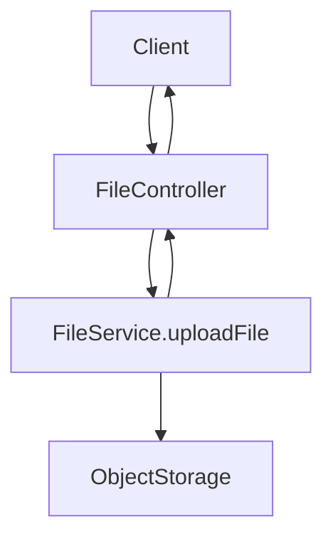

---

## LOA Service (loa-service)
Endpoints:
- POST /transaction
- GET /transaction/history
- GET /transaction/historyDetails/{id}
- GET /download/loa

POST /transaction request (LoaRequestDTO example):
```json
{
  "originMemberCode": "M123",
  "hospitalCode": "H123",
  "patient": { "name":"John Doe", "dob":"1980-01-01" },
  "serviceType": "INPATIENT",
  "requestedBy": "provider"
}
```

Response: proxied Medicard API object inside `data`.

Flowchart:
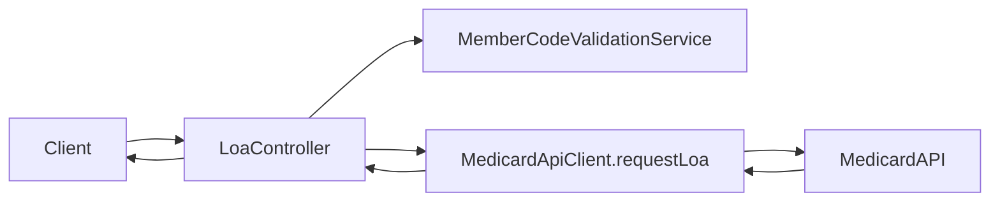

---

## FaceScan Service (facescan-service)
Base: `/api/v1/faceScan`

Endpoints: eligibility, acceptTnc, storeResult, history, fetchResult, masterData — all JSON.

Eligibility request example:
```json
{
  "userId": "user@example.com",
  "deviceId": "device-abc",
  "imageToken": "base64-or-ref"
}
```

Flowchart:
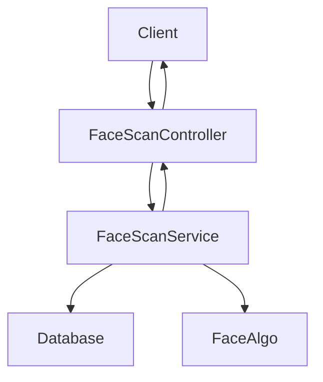

---

## Membership Service (membership-service)
Base: `/api/v1/membership`

Endpoints:
- GET /memberProfile?memberCode=
- GET /dependent?memberCode=
- GET /maternity?memberCode=
- plus utility/proxy endpoints (virtual-id, utilization)

Response example (memberProfile):
```json
{
  "statusCode":"200",
  "response":"SUCCESS",
  "data": {
    "memberCode":"M123",
    "name":"Jane Doe",
    "dob":"1990-05-01",
    "plan":"Gold",
    "dependents": []
  }
}
```

Flowchart:
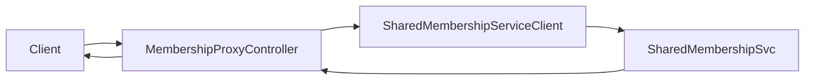

---

## How to get exact DTO fields
To expand any endpoint to a fully-accurate JSON schema:
1. Tell me which endpoint(s) you want expanded.
2. I'll read the corresponding DTO classes under the service (e.g., `auth-service/src/main/java/.../domain/request/*.java` or `domain/dto`) and generate full JSON Schema + example.

I can now generate full, per-endpoint JSON schemas for whichever endpoints you designate. Which endpoints should I expand first? (You can say "all" but it's large — I recommend batching by service, e.g., "auth-service all", then "claims-service submit", etc.)  

